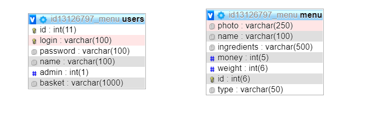

# restaurant-website #

# Проект #

### 1. Главная страница и страница О нас: ###
* Основная информация про компанию и ресторан

### 2. Страница меню: ###
* Данные из бд MySQL
* Сортировка по типу блюд

### 3. Страница корзины: ###
* Пользователь не в системе не может добавлять в корзину блюда
* Возможность добавлять в корзину со страницы отдельного блюда
* Очистка, подсчет количества, увеличение/уменьшение количества

### 4. Страница регистрации/авторизации: ###
* Проверка сходства паролей при регистрации
* Пароли хешируются

### 5. Права админа: ###
* Возможность добавлять, изменять, удалять блюда

